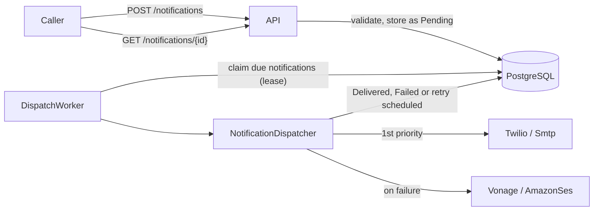

# Notification Service

A service that accepts requests to notify customers and delivers them over SMS or email
through configurable, prioritised providers with failover and retries.

Built with .NET 10, ASP.NET Core minimal APIs, EF Core and PostgreSQL, in a hexagonal (ports and adapters) structure
with a DDD domain model.

**Contents:** [Getting started](#getting-started) · [How the requirements are met](#how-the-requirements-are-met) ·
[Architecture](#architecture) · [Ubiquitous language](#ubiquitous-language) · [API](#api) ·
[Dispatching and failover](#dispatching-and-failover) · [Retry strategy](#retry-strategy) · [Providers](#providers) ·
[Persistence](#persistence) · [Testing](#testing) · [Assumptions](#assumptions) ·
[Trade-offs and known limitations](#trade-offs-and-known-limitations) · [What would come next](#what-would-come-next) ·
[Working on this repository with AI](#working-on-this-repository-with-ai) · [AI usage](#ai-usage)

## Getting started

Requirements: .NET 10 SDK and Docker.

```bash
docker compose up -d          # PostgreSQL + Mailpit (http://localhost:8025)
dotnet build
dotnet test                   # needs Docker: integration tests start PostgreSQL and Mailpit with Testcontainers
dotnet run --project src/NotificationService.Api
```

The API listens on http://localhost:5080; the database schema is created on startup (Development only).

- API reference and a UI to try requests: http://localhost:5080/scalar
- Ready-made demo requests (send, idempotency, errors, health): `src/NotificationService.Api/NotificationService.Api.http`,
  runnable from Visual Studio, Rider or VS Code (REST Client)
- Sent emails: http://localhost:8025 (Mailpit)

**Demo.** Development settings (`appsettings.Development.json`) make Twilio fail 30% of attempts and shorten retry delays to seconds,
so sending a few SMS shows failover to Vonage in the delivery attempts:

```bash
curl -i -X POST http://localhost:5080/notifications -H "Content-Type: application/json" \
  -d '{"customerId":"c-1","channel":"Sms","recipient":"+37060012345","body":"Your code is 123456"}'
curl http://localhost:5080/notifications/<id from the response>
```

Provider configuration is reloaded while the app runs. Set `"Simulation": { "Mode": "AlwaysFail" }` on both SMS providers in
`appsettings.Development.json` to see retries being scheduled, or `"Enabled": false` on `Smtp` to send email through `AmazonSes`.

## How the requirements are met

| Requirement | Where |
|---|---|
| At least two channels | `Sms` and `Email`, each with a validated recipient address (E.164 phone number, email address) |
| Provider abstraction | `INotificationProvider` port; simulated Twilio, Vonage and Amazon SES, and a real SMTP provider (MailKit) |
| Failover by priority | `ProviderSelector` orders eligible providers; `NotificationDispatcher` moves to the next on a transient failure, timeout or exception |
| Retry later when no provider can deliver | `RetryPolicy` (exponential backoff with jitter) and the background `DispatchWorker` |
| Configurable providers (enabled, priority, channels) | `Notifications:Providers` in `appsettings.json`, reloaded at runtime and validated at startup |
| DDD and a clear ubiquitous language | `Notification` aggregate and value objects in a dependency-free domain project; [glossary](#ubiquitous-language) used in code and docs |
| Automated tests, especially selection, failover and retry | `ProviderSelectorTests`, `NotificationDispatcherTests`, `RetryPolicyTests`, and end-to-end `DeliveryPipelineTests`; [Testing](#testing) |
| Design decisions and trade-offs | Throughout this README, summarised in [Trade-offs](#trade-offs-and-known-limitations) |
| AI usage | [AI usage](#ai-usage) |
| Git history showing the evolution | One commit per step (skeleton, domain, retry policy, selection, dispatcher, use cases, persistence, providers, worker, API, end-to-end tests, docs), not squashed |

## Architecture

Dependencies point inwards: the domain knows nothing about the application, the application nothing about infrastructure.

| Project | Contains |
|---|---|
| `NotificationService.Domain` | `Notification` aggregate, value objects, `RetryPolicy`, `INotificationRepository` port. No dependencies. |
| `NotificationService.Application` | Use cases (send, get, dispatch one notification), `INotificationProvider` port, `ProviderSelector`, `NotificationDispatcher`, options |
| `NotificationService.Infrastructure` | EF Core + PostgreSQL repository, provider implementations |
| `NotificationService.Api` | HTTP endpoints, error handling, background `DispatchWorker`, composition root (`Program.cs`) |



- **The domain is pure.** It takes the current time as a parameter (`DateTimeOffset now`) instead of reading a clock, and never
  does I/O. Business rules (state transitions, when to retry, when to give up) are unit-tested without mocks.
- **The aggregate protects its invariants.** A `Notification` only changes through `RecordDeliveryAttempt` and `ScheduleRetryOrFail`;
  value objects (`Recipient`, `NotificationContent`, `IdempotencyKey`, ...) cannot be created invalid. Their error messages never
  contain personal data, so they are safe in logs and API responses.
- **Providers never see the aggregate.** They receive a `DeliveryRequest` and return a `DeliveryOutcome`; only the dispatcher changes the notification.
- **Failover and retry are domain rules, not a resilience library.** Which provider is next, what counts as permanent, and when to
  give up are business decisions, so they live in the domain and application layers rather than in Polly policies.

The main decisions, with the alternatives considered, are recorded in [`docs/adr/`](docs/adr/README.md).

## Ubiquitous language

| Term | Meaning |
|---|---|
| **Notification** | A request to inform a customer of something through one channel, plus its delivery history. The aggregate root. |
| **Channel** | The communication medium: `Sms` or `Email`. |
| **Recipient** | A channel together with a validated address for it (E.164 phone number or email address). |
| **Content** | What the customer receives: a body and, for email, a subject. |
| **Provider** | An external service that delivers notifications on one or more channels (e.g. Twilio, Amazon SES). |
| **Delivery attempt** | One provider being asked to deliver a notification, and the outcome. |
| **Idempotency key** | A caller-chosen key for one logical send request; repeating the request with the same key returns the original notification. |
| **Dispatch** | One pass over the eligible providers for a notification, in priority order, until one delivers it. |
| **Retry** | A later dispatch, scheduled when a dispatch ended without delivery. |
| **Delivery outcome** | `Delivered`, `TransientFailure` (another provider or a later retry may succeed) or `PermanentFailure` (no provider can deliver it, e.g. the address does not exist). |

## Accepting notifications

Sending is asynchronous: a request is validated, stored as `Pending` and acknowledged immediately; delivery happens in the background.
This keeps callers independent of provider latency and outages, and means an accepted notification survives restarts.

**Idempotency.** Callers retry requests too (timeouts, their own restarts). An optional idempotency key prevents duplicates:

- Same key, same details: the original notification is returned and nothing new is created.
- Same key, different details: the request is rejected as a conflict, since silently returning the earlier notification would hide a caller bug.
- Two concurrent requests with the same key: a unique index decides the winner; the other request returns the winner's notification.
- Assumption: keys are unique across all calling services (e.g. GUIDs or `<service>:<business id>`). With authentication in place, keys would be scoped per caller.

## API

| Request | Responses |
|---|---|
| `POST /notifications` with optional `Idempotency-Key` header | `202 Accepted` + `Location` for a new notification; `200 OK` when the idempotency key was already used for the same request; `400` for an invalid request; `409` when the key was used for a different request |
| `GET /notifications/{id}` | `200 OK` with status and delivery attempts; `404` if unknown |
| `GET /health/live`, `GET /health/ready` | Liveness (process is up) and readiness (database reachable) |

```http
POST /notifications
Idempotency-Key: order-42-shipped
Content-Type: application/json

{ "customerId": "c-1", "channel": "Email", "recipient": "jane@example.com",
  "subject": "Your order has shipped", "body": "It will arrive tomorrow." }
```

- **202 rather than 201:** the notification is accepted, not yet delivered. The `Location` header is where the caller follows its progress.
- **Errors are RFC 9457 problem details.** Validation stays in the domain: value objects throw a `DomainException`, and one exception
  handler maps it to 400 (messages never contain personal data, so they are safe to return), and an idempotency conflict to 409.
  Unreadable JSON is a 400 that names the offending field without echoing its value. Anything unexpected is a 500 without internals.
- **Enums are strings** (`"Sms"`, `"Delivered"`); numbers are rejected, so a typo cannot silently select a different channel.
- **Separate API contracts** (`SendNotificationRequest`, `NotificationResponse`) keep the HTTP shape independent of the application's read model.
- **OpenAPI and Scalar are only exposed in Development**, like the automatic database migration on startup. In production, migrations
  would run as a deployment step (e.g. an EF migration bundle) so instances starting together do not race and the app needs no DDL permissions.
- Not included, by scope: authentication, rate limiting, and listing/searching notifications.

## Dispatching and failover

A **dispatch** tries the eligible providers in priority order and stops at the first one that delivers:

| Provider result | What happens |
|---|---|
| `Delivered` | Notification is `Delivered`; no other provider is called. |
| `TransientFailure` | The next provider is tried. |
| Exception thrown | Treated as a `TransientFailure` (only the exception type is stored; details go to the logs). |
| No response within `DeliveryAttemptTimeout` | Treated as a `TransientFailure`; the call is cancelled. |
| `PermanentFailure` | Notification is `Failed`; no other provider is called. |

If every provider fails transiently, or none is eligible, a retry is scheduled (see below).
Each retry starts again from the highest-priority provider, since the primary may have recovered.
If the service is shutting down mid-dispatch, nothing is scheduled; the notification stays due and is picked up again.

## Dispatch worker

A background service (`DispatchWorker`) delivers accepted notifications:

1. Every `PollingInterval` (default 5 s) it **claims** up to `BatchSize` (default 20) due notifications, setting a lease of `LeaseDuration` (default 2 min).
2. It **dispatches the batch concurrently**, each notification in its **own DI scope**: load, dispatch, save. Its own database context means
   one failed save cannot leave dirty state that breaks the others, and one failing notification never stops the batch
   (it keeps its lease and is picked up again when the lease expires).
3. If the batch was full, it claims the next one straight away instead of waiting, so a backlog (e.g. after an outage) drains quickly.

Settings are in `Notifications:Worker` and validated at startup, including that **the lease outlasts the longest possible dispatch**
(`DeliveryAttemptTimeout` × enabled providers for a channel). Otherwise another instance could dispatch a notification that is
still being worked on. This is also why the batch is dispatched concurrently: a lease sized for one dispatch would not cover
a whole batch dispatched one after another.

**Several instances.** Claiming uses `FOR UPDATE SKIP LOCKED` (see Persistence), so instances share the work without coordination.
The handler re-checks that a notification is still due after loading it, and optimistic concurrency rejects the save if another
instance processed it after our lease expired; that result wins and ours is discarded (logged).

**Shutdown.** Cancellation stops in-flight dispatches without saving; their leases expire and the notifications are dispatched again.
If a provider had already accepted one, the customer may get it twice: delivery is *at least once*.

**Trade-offs.** Polling adds up to `PollingInterval` of latency and a cheap query per interval (served by a partial index); a message broker or
PostgreSQL `LISTEN/NOTIFY` would react immediately but add infrastructure. A notification that fails *unexpectedly* every time
(e.g. a bug) is retried at every lease expiry without counting towards its retry limit; a per-notification claim counter
with a dead-letter status would be the next step.

## Retry strategy

- A dispatch that ends without delivery (all eligible providers failed transiently, or none was eligible)
  schedules the next dispatch using exponential backoff with jitter: about 1, 2, 4, 8, 16, 32 and 60 minutes.
- Jitter (±20%) spreads out retries of notifications that failed together during a provider outage.
- After 8 dispatches (about two hours) the notification is marked `Failed`.
- A `PermanentFailure` (e.g. the address does not exist) fails the notification immediately, because retrying cannot help.

## Provider configuration

Providers are configured in the `Notifications:Providers` section, keyed by provider name:

```json
"Notifications": {
  "Providers": {
    "Twilio":    { "Enabled": true, "Priority": 1, "Channels": [ "Sms" ], "Simulation": { "FailureRate": 0.2 } },
    "Vonage":    { "Enabled": true, "Priority": 2, "Channels": [ "Sms" ] },
    "Smtp":      { "Enabled": true, "Priority": 1, "Channels": [ "Email" ] },
    "AmazonSes": { "Enabled": true, "Priority": 2, "Channels": [ "Email" ], "Simulation": { "Mode": "AlwaysFail" } }
  },
  "Smtp": { "Host": "localhost", "Port": 1025, "FromAddress": "notifications@example.com" }
}
```

- A provider is **eligible** for a channel when it is configured, enabled, configured for that channel and technically supports it.
- Eligible providers are tried in ascending `Priority` (1 first); equal priorities are ordered by name.
- A provider implementation without a configuration entry is never used, so adding code alone does not route traffic to it.
- Configuration is read on every dispatch, so disabling or re-prioritising a provider does not need a restart.
- **Validated at startup** (`ValidateOnStart`): an unknown provider name (e.g. a typo), a channel the provider cannot deliver on,
  a priority below 1, an enabled provider without channels, or invalid simulation/SMTP settings stop the application
  with a clear message instead of silently leaving notifications undelivered. Equal priorities are allowed (ordered by name).
  Having no enabled provider for a channel is allowed on purpose: it is how an operator pauses a channel, and notifications wait for retries.

## Providers

| Provider | Channel | Implementation |
|---|---|---|
| `Smtp` | Email | Real: sends through an SMTP server with MailKit. Locally this is Mailpit; open http://localhost:8025 to see sent mail. |
| `AmazonSes` | Email | Simulated |
| `Twilio` | SMS | Simulated |
| `Vonage` | SMS | Simulated |

**Why simulated providers.** Real Twilio, Vonage and SES integrations need accounts and credentials, and add nothing to the design
beyond an HTTP call. The simulated providers implement the same `INotificationProvider` port, so replacing one with a real HTTP client
changes no other code. They share a `SimulatedProvider` base whose behaviour is configured per provider under `Simulation`
(re-read on every attempt, so an outage can be switched on at runtime to demonstrate failover):

| Setting | Effect |
|---|---|
| `Mode: Normal` (default) | Delivers, except a random `FailureRate` share (0 to 1, default 0) of attempts that fail transiently. |
| `Mode: AlwaysFail` | Every attempt fails transiently, like an outage: the next provider is tried, then retries are scheduled. |
| `Mode: PermanentFailure` | Every attempt fails permanently, like a non-existent address: the notification fails immediately. |
| `Latency` (default `00:00:00.1`) | How long each attempt takes. Set it above `DeliveryAttemptTimeout` to simulate a hanging provider. |

**SMTP error classification.** Only a 5xx rejection of the *recipient* (e.g. `550 mailbox unavailable`) is a `PermanentFailure`,
because no provider can deliver to that address. 4xx responses, a rejected sender or message, connection, TLS and authentication
errors are `TransientFailure`s: they are problems with this server or its configuration, so another provider or a later retry may succeed.
The server's response text is logged by status code only, because it often echoes the recipient's address.
Each email carries an `X-Notification-Id` header and its `Message-ID` is stored as the provider message id, for tracing.
A new SMTP connection is opened per message; a connection pool would be the next step at higher volume.

## Persistence

PostgreSQL through EF Core. Two tables: `notifications` (the aggregate, with recipient and content as complex types)
and `delivery_attempts` (an owned collection).

- **Claiming work across instances.** The dispatch worker claims due notifications with a single statement:
  `UPDATE ... WHERE id IN (SELECT ... FOR UPDATE SKIP LOCKED) RETURNING id`.
  `SKIP LOCKED` lets several instances claim different rows at the same time without blocking each other.
  Claiming returns only ids; each notification is then loaded, dispatched and saved as its own unit of work.
- **Leases instead of long transactions.** Claiming sets `locked_until`. The row locks are released immediately,
  so no transaction stays open while providers are called. If an instance crashes, its lease expires and another instance takes over.
- **Optimistic concurrency.** PostgreSQL's `xmin` system column is the concurrency token. If a lease expired and
  another instance processed the notification meanwhile, the slower instance's save fails instead of overwriting.
- **Persistence details stay out of the domain.** `locked_until` and `xmin` are EF shadow properties; the only concession
  in the domain model is a private parameterless constructor for materialization.
- A partial index on `next_attempt_at WHERE status = 'Pending'` keeps polling cheap as delivered notifications accumulate.

### Migrations

```bash
dotnet tool restore
dotnet ef migrations add <Name> --project src/NotificationService.Infrastructure --startup-project src/NotificationService.Api --output-dir Persistence/Migrations
```

## Testing

| Project | What it covers | Needs Docker |
|---|---|---|
| `Domain.Tests` | Value objects, the `Notification` aggregate's state changes, retry policy backoff and jitter | No |
| `Application.Tests` | **Provider selection** (enabled, channel, priority), **failover**, timeouts, **retry scheduling**, idempotency, config validation; with hand-written fakes and `FakeTimeProvider` | No |
| `Infrastructure.Tests` | Simulated providers, SMTP error classification, startup validation of the real DI setup | No |
| `IntegrationTests` | PostgreSQL repository (claiming, leases, concurrency), dispatch worker, SMTP against Mailpit, and **end-to-end tests** | Yes |

**End-to-end tests** run the real application with `WebApplicationFactory` against a PostgreSQL container: HTTP request →
database → background worker → providers → HTTP response. Only two things are substituted:

- **Providers** are scriptable fakes registered under the real names (`Twilio`, `Vonage`, `Smtp`, `AmazonSes`), so the real
  `appsettings.json` priorities, channels and startup validation are what route the notifications.
- **The clock** is a `FakeTimeProvider`. Advancing it fires the worker's polling timer and makes retries due, so a retry
  scheduled a minute later is tested in milliseconds, without sleeps tied to real delays.

They cover delivery by the highest-priority provider, failover, retries until delivered, giving up after the maximum dispatches,
permanent failures, idempotent requests (delivered once), and every error response. The worker runs in the background, so tests
wait for outcomes by polling the API with a timeout rather than fixed delays.

They caught one real issue: outside Development, ASP.NET Core returned a bare 400 for unreadable JSON instead of the
problem details that had been checked manually in Development. A guard test also checks that the application really uses
the container's database, since a missed configuration override would otherwise run the tests against a local database unnoticed.

## Assumptions

- **The caller sends the recipient's address.** This service does not own customer data; `CustomerId` is kept only for traceability.
  The alternative (the caller sends only a customer id and the service looks the address up) would make it depend on a customer service.
- **"Delivered" means a provider accepted the notification**, not that it reached the phone or inbox. Provider delivery receipts
  would come in through webhooks (see [What would come next](#what-would-come-next)).
- **Callers are trusted internal services.** There is no authentication, and idempotency keys are assumed to be unique across callers.
- **One notification, one channel.** A caller wanting SMS *and* email sends two requests; the service does not choose the channel.
- **Content is ready to send.** Templates, localisation and personalisation are the caller's responsibility.
- **Instance clocks are synchronised** (e.g. NTP) to well within the lease duration, since leases and due times use each instance's clock.

## Trade-offs and known limitations

| Decision | Benefit | Cost |
|---|---|---|
| Asynchronous delivery (store, then deliver in the background) | Callers never wait for or depend on providers; accepted notifications survive restarts | Callers learn the outcome by polling `GET`; delivery is not instant |
| Database polling instead of a message broker | No extra infrastructure; the database already holds the state | Up to one polling interval (5 s) of latency, and a small query per interval |
| Leases with `SKIP LOCKED` and optimistic concurrency | Several instances share work without coordination or long transactions | A crash after a provider accepted a notification but before saving can send it twice: delivery is **at least once** |
| Retries count failed dispatches, not provider calls | "Give up after about two hours" holds however many providers are configured | A dispatch with several slow providers counts once, however long it took |
| Simulated Twilio, Vonage and SES | No accounts or credentials needed; failures can be switched on for demos | Real API error mapping is only shown for SMTP |
| Exceptions for invalid input | Value objects cannot exist in an invalid state, and one handler maps all of them to 400 | Validation stops at the first error instead of returning every problem at once |

Known limitations:

- **A notification that fails unexpectedly every time** (e.g. a bug) is retried at every lease expiry without counting towards its retry limit.
- **No retention policy:** notifications, including addresses and message bodies, are kept indefinitely.
- **One SMTP connection per message**, which is simple but would not scale to high volumes.
- **No authentication, rate limiting, or listing and searching of notifications**, which were out of scope.

## What would come next

- **Circuit breaker per provider**, so a provider that is down is skipped for a while instead of costing a timeout on every dispatch.
- **Poison-notification handling:** a claim counter and a dead-letter status for notifications that keep failing unexpectedly.
- **Delivery-status webhooks:** receive provider delivery receipts (delivered to handset or inbox, bounced) and notify callers of final outcomes.
- **Outbox** for publishing status-change events reliably, together with the state change that caused them.
- **Messaging adapter** (e.g. a queue consumer) as a second way to accept notifications; the application layer is already transport-agnostic.
- **Push notifications** as a third channel: a new `Channel`, recipient type and provider.
- **Authentication**, with idempotency keys scoped per caller.
- **Observability:** OpenTelemetry traces and metrics (delivery latency, failures per provider, queue depth).
- **Real provider integrations** replacing the simulated ones, and **data retention** that purges old notifications.
- **Migrations as a deployment step** (an EF migration bundle in CI) instead of on startup.

## Working on this repository with AI

The repository is set up so that an AI assistant (Claude Code) can work on it safely and with the same context as a developer.
Instructions are treated as maintained project infrastructure, reviewed like code.

| What | Where | Purpose |
|---|---|---|
| Project guide | `CLAUDE.md` | How we work, commands, architecture, core rules, ubiquitous language, recipes for common changes |
| Layer guides | `CLAUDE.md` in `src/*.Domain`, `src/*.Infrastructure`, `src/*.Api`, `tests/` | Rules and pitfalls for one layer, loaded only when working there |
| Decision records | `docs/adr/` | *Why* the design is the way it is, so changes do not undo decisions unknowingly |
| Guardrails | `.claude/settings.json` | Permissions: the AI can build, test and read history, but cannot commit, push, discard changes, edit migrations or read local secrets |
| Automated checks | `.claude/hooks/` | Blocks personal data in exception messages and log templates; formats edited C# files; builds and runs unit tests before handing work back |
| Personal context | `CLAUDE.local.md` (not committed) | Each developer's own machine and editor notes |

The principle: **rules that matter are enforced by tools, not only written down.** "The developer reviews every commit" is a
permission rule, not a request; "no personal data in logs" is a check on every edit; "leave the build green" runs automatically.
The written guidance covers what tools cannot check: design intent, domain language and trade-offs.

These guardrails keep an AI assistant within the team's workflow; they are not a security boundary. Branch protection and CI
remain the real controls for what reaches the main branch.

## AI usage

AI wrote most of this project, and it matters to be clear about how. **All production code and tests were generated by AI.**
The developer made the product and architecture choices, reviewed every step before committing it, ran and validated everything
on their machine, and fixed or redirected the AI where needed.

### Tools and how they were used

| Phase | Tool and model | What it did |
|---|---|---|
| Planning and steps 0–6 (skeleton to persistence) | Claude in the Claude desktop app (Cowork mode), configured for Claude Opus 5.5 | Analysed the task and proposed the architecture, domain model, test plan and a 12-step build plan; wrote the code, tests, README sections and `CLAUDE.md`. It could not build or run anything in its environment, so every build, test and migration ran on the developer's machine. |
| Steps 7–11 (providers to documentation) | Claude Code (CLI) with Claude Opus 5.5 | Wrote the providers, dispatch worker, API and end-to-end tests, and ran `dotnet build`, `dotnet test` and the application itself before handing each step over. It also looked up package versions and security advisories. |

| After the task | Claude Code with Claude Opus 5.5 | At the developer's request, planned how to prepare the repository for ongoing AI-assisted work, then restructured `CLAUDE.md` into layer guides, wrote the decision records, and added the permission rules and hooks (each hook tested with sample input before being enabled). |

`CLAUDE.md` (in the repository) carried the context between the two tools: the decisions made so far, conventions, known pitfalls,
the remaining steps, and the working rules, including that the AI must never commit or discard changes.

### What the developer decided

- **Scope and architecture choices,** from options the AI laid out with a recommendation: SMS and email only (Push was offered and
  dropped); a REST API only, without a messaging consumer; PostgreSQL rather than SQLite, to show more; the caller sends the recipient's address.
- **The way of working:** the AI writes, the developer reviews and commits (chosen over letting the AI commit). The AI proposed
  small steps with one commit each; the developer wrote the commit messages.
- **Moving from the desktop app to Claude Code** after step 6, so the AI could build, test and run the code itself instead of handing over unverified code.
- Accepting a change to step 6 code proposed in step 8 (see below), committing `CLAUDE.md` to the repository, and asking for the `.http` demo file.

Most detailed design choices were proposed by the AI and accepted after review, not debated: the aggregate design, a pure domain,
retries counting dispatches, transient versus permanent outcomes, the idempotency rules, leases with `SKIP LOCKED` and `xmin`,
no resilience library for failover, Shouldly and xUnit v3, and hand-written fakes. They are explained in this README so that
they can be defended, not just inherited.

### Problems found, and what caught them

| Problem | Cause | Caught by |
|---|---|---|
| `Testcontainers.PostgreSql` 4.7.0 pulled in a vulnerable SSH.NET (GHSA-mggc-4xg6-vcxf) | Package version chosen by the AI from memory | NuGet audit, failing the build through warnings-as-errors; the AI then checked the advisory and moved to 4.15.0 |
| The obsolete `PostgreSqlBuilder()` constructor | Older API used by the AI | A web search by the AI, and later the compiler (CS0618); fixed by the developer |
| Loading claimed notifications with `FromSql` failed at runtime: EF looked for a `Content_Body` column | AI-written raw SQL combined with EF complex types | Integration tests against a real PostgreSQL container; replaced by a LINQ query |
| EF migrations failed the build on code style | Build settings from step 0 did not anticipate generated migrations | The build; migrations were excluded in `.editorconfig` |
| `Microsoft.AspNetCore.OpenApi` pulled in a vulnerable `Microsoft.OpenApi` 2.0.0 (GHSA-v5pm-xwqc-g5wc) | Transitive dependency | NuGet audit and warnings-as-errors; pinned to a patched version |
| Each notification had to be saved in its own scope, but the step 6 repository could only save entities loaded by the same database context; a batch dispatched one after another would also outlive its lease | Step 6 design did not anticipate the worker | The AI while designing the worker; it changed claiming to return ids, which the developer reviewed and accepted |
| Malformed JSON returned 500 | Missing error mapping | The AI running the application and sending bad requests by hand |
| Outside Development, unreadable JSON returned a bare 400 instead of problem details | ASP.NET Core only throws for bad requests in Development, and the manual check ran in Development | End-to-end tests, which run in a Testing environment |

Two claims from the first phase were not verified when made and were checked later: that the generated migration would contain no
`xmin` column (wrong: it appears in the migration, marked as a row version) and that PostgreSQL would not create one (right:
`xmin` is only the system column, confirmed in `pg_attribute`). The explanation of the `FromSql` bug remains a diagnosis
based on EF's error rather than something confirmed against EF's documentation; the LINQ query avoids it either way.

A process problem also cost time in the first phase: several files the AI had written were replaced with their earlier content,
probably by unsaved editor tabs being saved over them, so some fixes had to be reapplied by hand. `CLAUDE.md` now warns about this.

### How the output was validated

- The developer reviewed every step before committing it, and ran the build and tests.
- **Warnings as errors and NuGet vulnerability auditing** turned outdated or vulnerable package choices into build failures.
- **Integration tests against real PostgreSQL** caught what tests with fakes could not; **end-to-end tests** caught what a manual check in one environment could not.
- In the second phase, the AI built, tested and ran the application before handing each step over, and ran the end-to-end
  tests repeatedly to check they were not flaky. The developer checked the running application, including the demo requests.

### Lessons

- AI output needs checks that do not depend on the AI: warnings as errors, vulnerability auditing and real-database tests found
  problems the AI had introduced with confidence.
- An AI that can compile and run the code fixes most of its own mistakes before a human sees them; one that cannot hands over unverified code.
- A manual check only covers the environment it ran in.

This README, including this section, was drafted by Claude Code from both sessions' records and reviewed by the developer.
